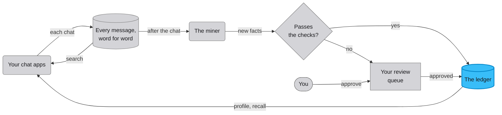

# Membro

Membro is a memory for AI assistants that runs on your own computer.
Your chat apps send it each conversation, and it keeps every message
word for word. It can load your old chats from a claude.ai export too.
After each chat a cheap model, the miner, reads it and writes down the
lasting facts about you. Then fixed rules in the code check each fact
before it's trusted, and a fact that fails a check waits for you to
review it. The facts that pass go in the ledger, Membro's list of what
it knows about you, and from them it builds a one-page profile.



Models get the memory back as the profile at the start of every chat,
a ranked recall of the facts that fit a question, and a word for word
search of past chats. Apps reach Membro through a small HTTP API. A
model like Claude Code reaches it through
[MCP](https://modelcontextprotocol.io/docs/getting-started/intro), an
open standard for connecting an AI app to outside tools and data.
Everything Membro remembers lives in one `data/` folder on your
computer: a [SQLite](https://sqlite.org) database, the files and voice
clips your apps send, and the snapshots. The service answers only on that computer,
unless you open it to your own tailnet.

## What it promises

- Nothing automatic ever deletes a fact. A fact can be replaced by a
  newer one, held for review or dismissed, and it stays in the ledger
  either way. A held or dismissed fact can be approved again, and a
  replaced one stays as history. The only hard deletes are the erasers
  you press on the admin page, and a restore, which replays the erasures
  you already made. A voice clip is the one exception. An app that
  captures voices can delete a clip its own voice bank has dropped,
  using your token.
- Every fact the miner finds is checked before it's trusted. Its names
  and its dates must appear in the chat it came from, and it can't come
  from roleplay or from a model's summary of you. A fact that fails a
  check is held for your review. If you turn on the optional judge pass,
  a model can release a fact held for a missing name, but only by
  quoting that name from the chat word for word.
- The messages you send are never changed. The profile is a cache
  rebuilt from the ledger, and it records which facts it was built from
  and where each of them came from.
- With no API keys, saving chats, search and keyword recall still work.
  Mining and profile rebuilds fail with a clear error, and never quietly
  do less. The judge pass, and the sweep that suggests facts to keep
  forever, skip without a key.

## What you need

You need Python 3.12 or newer. An Anthropic key turns on mining and the
profile, and an OpenAI key turns on embeddings, which let recall match a
question by meaning as well as by its words. Both keys are optional.

## Get it running

```sh
git clone https://github.com/shawn-durrani/membro.git
cd membro
./start.sh
```

Open http://127.0.0.1:8901. If that port is taken, set `MEMORY_PORT`.

The first run prints a recovery secret, unless you've set
`MEMORY_AUTH_TOKEN` in `.env`. Use the secret once to choose a password,
and from then on sign in with the password. Set `MEMORY_AUTH_TOKEN`
yourself to keep the secret the same from one start to the next. You'll
need that secret to reset a forgotten password later.

## Bring in your claude.ai chats

Stop the service first, or point `--data-dir` at a throwaway copy of
`data/`. Then unzip the export and run the importer on the folder. It
reads the unzipped folder, and can't read the zip.

```sh
unzip ~/Downloads/data-2026-08-01.zip -d ~/claude-export
.venv/bin/python scripts/import_claude_export.py --export-dir ~/claude-export
```

The importer's only guard against a running service is a coarse one.
With no `--data-dir`, it quits if anything answers on 127.0.0.1:8901.
That port is fixed in the script, so it won't notice a service on
another `MEMORY_PORT`. With `--data-dir` there's no check at all, and it
writes wherever you point it, whether the service is running or not.

The importer refuses to load the same account's export twice. An
import that stopped partway can be run again, and it never duplicates a
message.

## Connect a model through MCP

Register Membro's MCP server once, with your `MEMORY_AUTH_TOKEN`:

```sh
claude mcp add -s user membro -e MEMORY_AUTH_TOKEN=<token> -e PYTHONPATH=<repo> -- <repo>/.venv/bin/python -m memory_service.mcp_server
```

It gives a model four tools: `recall_memory`, `search_history`,
`save_memory` and `memory_summary`. `search_history` reads your chats
word for word, so it works only when the server has the token. The
other three work without it. A model can save a fact, but every save it
makes is held for your review. No agent can write straight into the
facts Membro trusts.

A second server, `memory_service.mcp_admin_server`, is read-only and
off until you register it. It has two tools, and it signs in with the
same token.

## Review what it learns

Facts that fail a check, and facts from a source Membro doesn't trust,
wait for you on the admin page. You can approve a fact, dismiss it,
hold it back from use, or replace it with a newer one.

The miner scores how much each fact matters, from 1 to 9. A score of 10
means a fact never fades with age, and only you can give it. The
Mathematics page draws the ledger as geometry and never shows what a
fact says.

## Backups and restores

Membro snapshots its database into `data/backups/` on a timer, and
keeps a set number of the newest. It can copy each snapshot to a second
folder too, named in `MEMORY_MIRROR_DIR`.

To go back to a snapshot, stop the service and run
`scripts/restore_snapshot.py` with the snapshot's path. It keeps a copy
of the live database in `data/backups/` first, and that copy is rotated
out with the other snapshots. Then it replays every erasure made since
the snapshot, so a restore never brings back what you erased. That
covers the voice clips your apps keep here too. A clip you deleted stays
deleted, and a person you forgot stays forgotten.

At the end the restore lists any clip whose audio file is missing, by
person and clip id. It keeps those clips, because nothing you erased
explains them. Put the file back in `data/voice_anchors/`, or delete
the clip. On the People page, it's the one that won't play. A restore
also signs every browser out of the admin page. The full procedure is
in the fleet's restore runbook, `runbooks/membro-restore.md` in the
workbench repo.

## Run it as a service

`ops/install-supervisor.sh` hands Membro to
[launchd](https://developer.apple.com/library/archive/documentation/MacOSX/Conceptual/BPSystemStartup/Chapters/CreatingLaunchdJobs.html),
the supervisor that keeps programs running on macOS. Restart it with
this command.

```sh
launchctl kickstart -k gui/$(id -u)/dev.membro.server
```

Before a restart, `GET /v1/busy` says whether work is under way that a
restart would cut off. That covers a running job, a backup, the rebuild
of search vectors after an embedding model change, and a judge pass. The
judge pass is an optional sweep in which a model takes a second look at
held facts. The fleet's deploy watcher waits on this route.

Everything Membro remembers lives under `data/`. Its settings and
secrets live in `.env` and `config.local.json` at the top of the repo.
Back up all three, and treat them as private.

## Reaching it from your other devices

Never open the port to the internet. Membro answers only on this
computer until you choose to open it to your own
[tailnet](https://tailscale.com/docs/concepts/tailnet), the private
network [Tailscale](https://tailscale.com) makes between your own
devices. Read [SECURITY.md](SECURITY.md) before you do.

## Docs

- [ARCHITECTURE.md](ARCHITECTURE.md): the design decisions that are
  settled.
- [docs/MEMORY_DESIGN.md](docs/MEMORY_DESIGN.md): how the memory works.
- [docs/MEMORY_INTEGRITY.md](docs/MEMORY_INTEGRITY.md): the checks every
  mined fact passes, and why they exist.
- [docs/API.md](docs/API.md): the HTTP contract.
- [docs/TUNING.md](docs/TUNING.md): every setting and its default.
- [docs/TESTING.md](docs/TESTING.md): what the tests guarantee.
- [docs/REFERENCES.md](docs/REFERENCES.md): the research it builds on,
  including claims we checked and rejected.
- [bench_memory/README.md](bench_memory/README.md): the LongMemEval
  benchmark harness, and what a run costs.

## Licence

[MIT](LICENSE).
